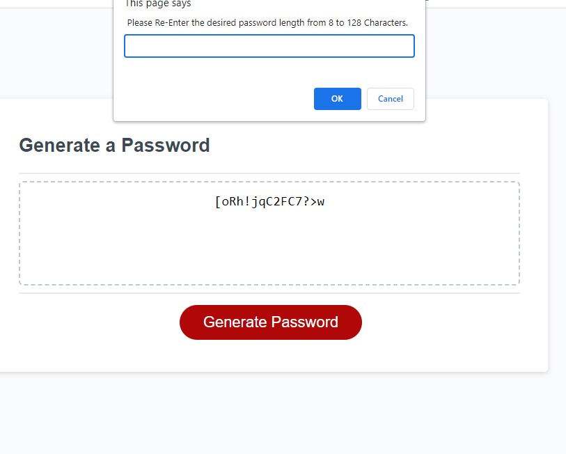

# Password Generator Usage
To use this password generator click the red "Generate Password" Button. You will be prompted to enter a length from 8 to 128.  If a value outside this range is entered you will be prompted to re-enter. Following prompts will be for the types of Characters to include in your password, Uppercase and Lowercase Letters, Special Characters, and finally Numbers.  Upon entering all fields your new password will be generated.

# Build Status
Final build ready for deployment

# Screen Shots

